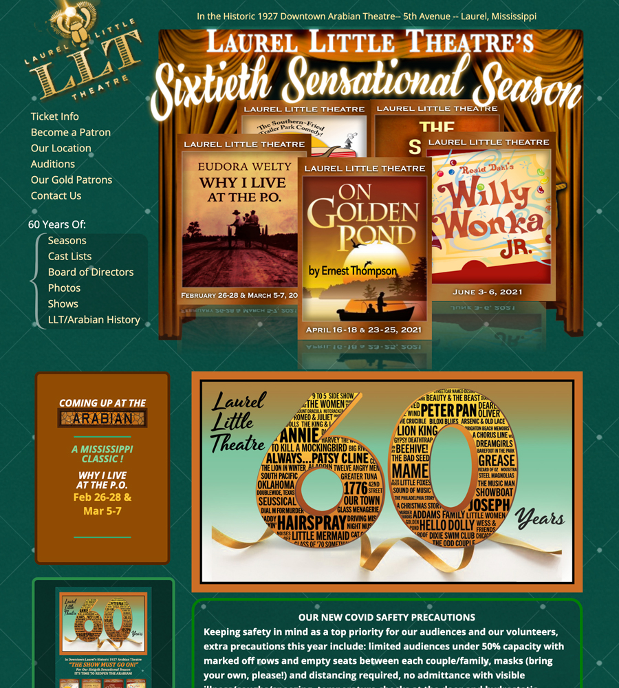

# LaurelLittleTheatre.com
This is the Git Repo of the LaurelLittleTheatre.com website


# Table of contents
1. [Installation](#Installation)
2. [Usage](#Usage)
3. [Live Demo](#Live_Demo)
4. [License](#License)
5. [Features](#Features)
6. [Technology](#Technology)
7. [Credits](#Credits)

<a name="Installation"></a>
## Installation
```sh
setup an apache server running php - Mamp is the easiest
```
<a name="Usage"></a>
## Usage
```sh
view index.php in a browser
```

<a name="Live_Demo"></a>
## Live Demo
laurellittletheatre.org

<a name='License'></a>
## License
[](https://lbesson.mit-license.org/)
<a name="Features"></a>
## Features
1.  carousel of current show posters
2.  photo archive
3.  data driven show information
<a name="Technology"></a>
## Technology
1.  PHP
2.  Perl Scripts
3.  Unix Scripts

<a name="Credits"></a>
## Credits
Eddie Caruso
Email: highlander1@aol.com

Bart Dority

**on github:** <a href='github.com/b0rgBart3'>b0rgBart3</a>

[](https://github.com/remarkablemark)

Email: borgBart3@gmail.com